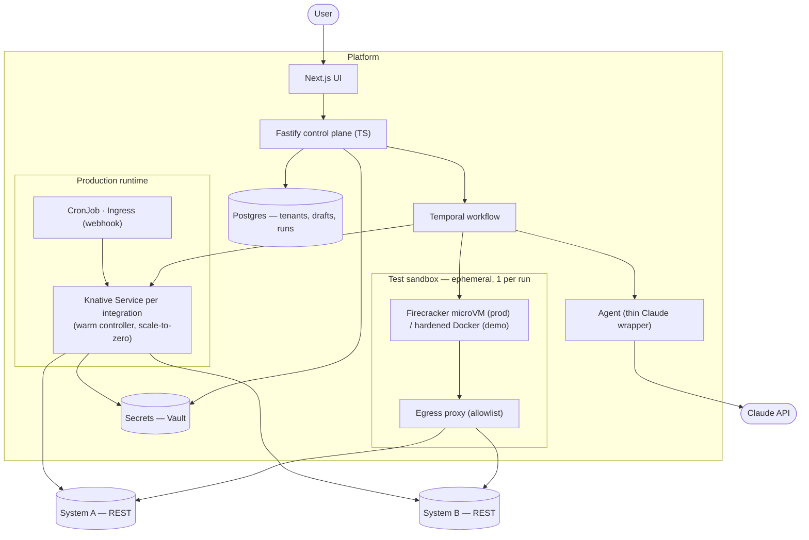

# Architecture

## The six-step flow, mapped to components

1. **User describes integration** → Next.js UI submits to the control plane.
2. **Agent generates code** → Multi-turn agent (Claude Agent SDK) inspects the target systems via tools (`inspect_system_health`, `dry_run_request`), drafts JavaScript, validates its own draft via `validate_in_sandbox`, iterates until green, then submits the final via `submit_final_integration`. Output is Zod-validated, then stored sha256-tagged.
3. **Code runs in isolated sandbox** → Hardened Docker container with no inbound network, allowlisted egress, read-only FS, dropped caps, walltime + memory limits. Production target: Firecracker microVMs.
4. **User reviews and approves** → UI shows the generated code, sandbox stdout/stderr, output payload. Approve transitions state in a Temporal workflow.
5. **Deployed to runtime** → Image is built per-integration and registered with a controller. In production: one Knative Service per integration (warm, scale-to-zero) that owns the integration's triggers and lifecycle.
6. **Runs on trigger** → Controller fires on its schedule (cron) / receives webhook / picks up SFTP file. For each fire, it spawns a fresh Firecracker microVM (or hardened Docker in the demo) — controller is warm, sandbox is ephemeral.

## System diagram

## Tech choices and why

| Component | Pick | Why |
|---|---|---|
| Frontend | Next.js | Deployable as static or SSR; runs on any cloud. Lingua franca for enterprise frontend teams. |
| Backend | Fastify (TypeScript, Node.js) | Generated code is TypeScript — `ssh2-sftp-client` for SFTP, native `fetch` for REST, `strong-soap` for SOAP, `xml2js` for XML. Single-language platform narrows the sandbox attack surface. Zod schemas validate the API boundary and the agent's output before storage. |
| Sandbox (prod) | Firecracker microVMs | Kernel-level isolation is the bar for running untrusted LLM output. Container-only sharing a kernel is one CVE away from escape. Firecracker is open source and runs on any KVM-capable Linux — not AWS-specific despite its origin. |
| Sandbox (demo) | Hardened Docker | Same isolation contract (no inbound, allowlisted egress, read-only FS, dropped caps, time/memory limits), laptop-friendly. Swap to Firecracker is a deployment change, not a redesign. |
| Runtime | Two-layer: Knative Service (controller pod, warm, scale-to-zero) per deployed integration → ephemeral Firecracker microVM per execution | The controller pod handles triggers (cron, webhook, SFTP watcher), retries, cursors, and observability — warm so webhook latency is sub-second and high-frequency crons don't pay cold-start every minute. Knative / KEDA scales it to zero when idle. Each actual run still spawns a fresh microVM so untrusted code never shares a kernel with another run. K8s Job per invocation is reserved for batch / compliance-restricted integrations where always-on is unacceptable. |
| Orchestration | Temporal | The flow `Draft → Tested → Approved → Deployed → Running` has a human-approval step. `await workflow.wait_for_signal("approved")` is a one-line gate that survives worker restarts. Same workflow code runs on every cloud — Step Functions / Cloud Workflows / Logic Apps would each be a separate implementation. |
| Datastore | Postgres | Row-level security for tenants. Managed (RDS / Cloud SQL / Azure Database) or self-hosted via the CloudNativePG operator. |
| Secrets | HashiCorp Vault | Cloud-agnostic; cloud-managed KMS (Secrets Manager / Secret Manager / Key Vault) substitutes via External Secrets Operator. |
| Agent | Claude Agent SDK (`@anthropic-ai/claude-agent-sdk`) | Integration generation is a multi-turn conversation with tools — the agent inspects the source system's schema, fetches sample payloads, drafts code, runs it through the sandbox, reads errors, revises, and iterates. The Claude Agent SDK gives us the loop, tools, MCP, and prompt caching out of the box. Three swappable implementations live behind the `AgentAPI` interface: `AgenticGenerator` (default, multi-turn with tools), `ClaudeCliAgent` (single-shot via `claude --print`), and `ClaudeAgent` (single-shot via Anthropic SDK). Custom tools: `inspect_system_health`, `dry_run_request`, `validate_in_sandbox`, `submit_final_integration`. |
| Observability | Prometheus + Loki + OTEL | Per-integration dashboard (invocations, success rate, p95, last error); logs stream live to the UI; OTEL traces propagate across outbound HTTP calls. |

## The questions the brief calls out

**Sandboxing the agent's code.** Firecracker in production: fresh microVM per execution, egress proxy with an allowlist derived from the integration's declared endpoints, CPU / RAM / walltime budget, no inbound network. Demo uses hardened Docker with the same boundaries (`--network=none` plus explicit egress proxy, `--read-only`, dropped capabilities, seccomp, time and memory limits).

**Test vs. production runtime.** Same generated code, different harness. Test = Temporal calls the sandbox as an activity. Production = a long-running controller pod per integration (Knative Service, scale-to-zero) handles triggers and spawns one ephemeral Firecracker microVM per fire. Image-per-integration means rollback is one Helm/Knative revision flip; the warm pod gets replaced with the previous version without touching the sandbox image.

**Secrets.** Vault in production; encrypted SQLite table in the demo behind the same `get_secret(name)` API. Injected as ephemeral env vars at process start; never persisted, never baked into images. Logs are scrubbed for declared secret values before reaching the observability stack.

**Tenant isolation.** Multi-tenancy is a stated constraint, not the focus of v1. The platform enforces `tenant_id` on every DB query (Postgres RLS in prod, repo-layer enforcement in the demo), runs sandbox executions per-request (never shared), and uses per-tenant secret bindings. Deploy model is single-tenant install per enterprise customer — the install story is intentionally simple (one Helm chart per cluster).

**Observing a running integration.** Per-integration view in the UI: last run, success rate, p95 duration, last error, live-streaming logs. Failed runs auto-retry with exponential backoff; N consecutive failures move the integration into `Degraded` state and alert the tenant's configured channel.

## What the demo simplifies (and what stays real)

| In production | In the demo |
|---|---|
| Firecracker microVMs on KVM-capable K8s | Hardened Docker — same isolation contract |
| Postgres | SQLite with a tenant-scoped repo layer |
| Vault | Encrypted SQLite table behind the same secret API |
| Temporal cluster on K8s | `temporal server start-dev` — the same engine, single binary |
| Knative Service per integration + Firecracker per fire | One shared `runner` process spawning Docker per fire |
| K8s CronJob | `node-cron` in the local runner |

The Temporal workflow code and the agent itself are identical to what production would run. The simplifications swap out infrastructure, not contracts.

## Future improvements (infrastructure)

The v1 ships with the core flow working. Infrastructure pieces I'd build out next, roughly in the order I'd take them on:

**Sandbox compute fleet.** A dedicated pool of KVM-capable EC2 bare-metal (or GCE confidential VMs / Azure DCsv3) running Firecracker, with a hot reserve for fast cold-start and spot/preemptible scaling for bursty load. Move sandbox lifecycle from per-Job creation to a microVM pool keyed by integration image hash, so common warm starts skip the boot tax.

**Network plane.** Cilium with eBPF for L4 NetworkPolicies and L7 egress visibility per pod. A service mesh (Linkerd for minimal ops, Istio if more surface area is needed) for mTLS between every internal service with per-ServiceAccount identity. Egress proxy as its own scaled Envoy tier behind a tenant-scoped allowlist, rather than sidecared per sandbox.

**Data and state infra.** HA Postgres via CloudNativePG with synchronous replication across two AZs and an async cross-region replica for opt-in DR. Continuous WAL streaming to S3-compatible object storage; RPO 5 min, PITR 30 days. Temporal cluster sized for the workload — 3+ frontend, history, and matching nodes, dedicated Postgres backing store, history-shard count tuned for expected workflow volume.

**Secrets and KMS.** Vault HA cluster with auto-unseal via cloud KMS. Dynamic secrets engines for the integration target systems — issue short-lived credentials at run start, expire on completion. BYOK via cloud KMS (CloudHSM / Cloud HSM / Azure Managed HSM) for regulated customers. Cosign-signed images verified at admission via Kyverno.

**Observability infra.** Prometheus federation with Thanos for long-term metrics retention; Loki cluster with object-storage backend; Tempo for distributed tracing; OpenTelemetry Collector with per-tenant pipelines. Grafana dashboards split between per-tenant view (integration health, run history) and platform-operator view (capacity, error budgets, cost attribution).

**Release infra.** GitOps via ArgoCD on the customer's cluster, pulling signed Helm releases from an OCI registry. CI pipeline (GitHub Actions in-cluster runners) does build + SBOM generation (Syft) + vulnerability scan (Trivy) + Cosign sign + push. Pre-release gate runs the agent eval corpus, tenant-isolation suite, and a cross-cloud parity matrix (deploy to EKS / GKE / AKS and run the integration test corpus on each).
