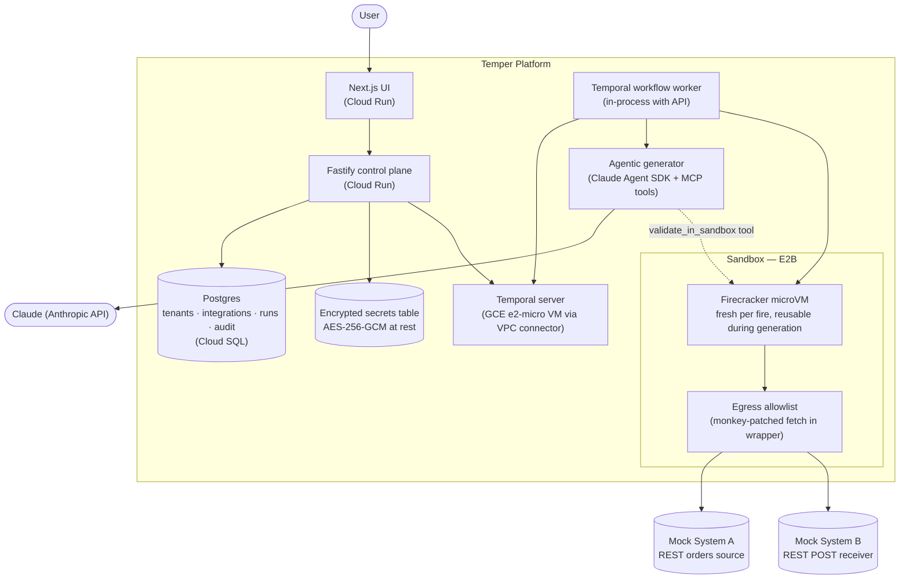

# Integration Platform — Take-Home Demo

### 🚀 Live demo: **https://temper-ui-444565930301.us-west1.run.app**

A working slice of the platform described in [ARCHITECTURE.md](ARCHITECTURE.md). User describes an integration in plain English, an agentic Claude loop writes JavaScript and validates it in a sandbox until it passes, you approve, then it gets deployed and runs against the actual target systems.

Live and deployed on GCP Cloud Run. Source generation goes through the **Claude Agent SDK** (multi-turn, tools, MCP). Sandbox is **E2B** (Firecracker microVMs as a service — real VM-level isolation, not container-only). Workflow engine is **Temporal**, self-hosted on a free-tier `e2-micro` VM reachable only via a VPC connector. State persists in **Cloud SQL Postgres** with tenant-scoped queries.

## Live URLs

| Service | URL |
|---|---|
| UI (ChatGPT dark mode) | https://temper-ui-444565930301.us-west1.run.app |
| Platform API + worker | https://temper-platform-444565930301.us-west1.run.app |
| Mock System A (REST orders source) | https://temper-mock-a-444565930301.us-west1.run.app |
| Mock System B (REST POST receiver) | https://temper-mock-b-444565930301.us-west1.run.app |

The mocks model two distinct enterprise systems being integrated. Each runs as its own Cloud Run service with a public URL so E2B's sandbox can reach them.

## System diagram



## Try it from scratch — three trigger types in the live UI

Open https://temper-ui-444565930301.us-west1.run.app and hard-refresh (Cmd+Shift+R) to clear any cached JS.

For each scenario: click **"+ New integration"** in the sidebar, **clear the autofilled textarea**, **select the trigger type** under "Trigger", **paste the prompt**, and click the **green arrow-up Submit** in the textarea's bottom-right corner. Watch the status pill cycle `Draft → Generating → Tested` in ~15-30 seconds, then click **Approve** to walk to **Deployed** (~3-5 sec).

### 1) CRON — poll System A, transform, POST to System B

Trigger: **cron**, expression `*/15 * * * *`

```
Poll secrets.SYSTEM_A_URL/orders?since=secrets.CURSOR for new orders.
For each order, transform to {orderId: order.id, customerName: order.customer,
totalAmount: order.amount} and POST to secrets.SYSTEM_B_URL/orders.
Return the latest created_at as the new cursor in the output.

Hostnames: temper-mock-a-444565930301.us-west1.run.app,
temper-mock-b-444565930301.us-west1.run.app.
```

Expected: 10 orders actually move from System A to System B. Verify at https://temper-mock-b-444565930301.us-west1.run.app/received.

### 2) WEBHOOK — receive a JSON order payload, forward to System B

Trigger: **webhook**, path `/incoming`

```
A webhook receives a JSON order body. If triggerPayload is null or undefined,
return {ok: true, output: {message: 'no payload to process'}}.
Otherwise transform the order from {id, customer, amount, items} to
{orderId: id, customerName: customer, totalAmount: amount, itemCount: items.length}
and POST it to secrets.SYSTEM_B_URL/orders.

Hostnames: temper-mock-b-444565930301.us-west1.run.app.
```

Expected: sandbox runs with `triggerPayload=null` (no real webhook fired during /test), code handles the null case and returns `{ok:true, output:{message:'no payload to process'}}`, integration walks to Tested. In production, the runner's webhook listener would route real inbound POSTs to this code.

### 3) SFTP — process CSV rows from a file-drop event

Trigger: **sftp**, host `sftp.example.com`, port `22`, path `/inbox`, pattern `*.csv`

```
An SFTP file watcher fires when a new CSV lands on /orders/. The triggerPayload
contains {filename, rows} where rows is an array parsed from the CSV with columns
id, customer, amount, currency, created_at. If triggerPayload is null or undefined
or has no rows, return {ok: true, output: {message: 'no file event'}}.
Otherwise for each row, POST {orderId: id, customerName: customer,
totalAmount: parseFloat(amount)} to secrets.SYSTEM_B_URL/orders.
Return {ok: true, output: {processed: rows.length, filename}}.

Hostnames: temper-mock-b-444565930301.us-west1.run.app.
```

Expected: sandbox runs with `triggerPayload=null`, code returns `{ok:true, output:{message:'no file event'}}` in ~250ms, integration walks to Tested. The agent generated proper CSV-processing + SFTP code that the runner would invoke for real file events in production.

### Notes

- **Why only cron actually moves orders end-to-end**: the cloud deploy doesn't include the `runner` service (intentional — kept the deploy minimal). The cron path moves data because the workflow's test step polls real System A and POSTs to real System B. For webhook/sftp, real firing requires the runner — see "What's intentionally not in the deploy" below.
- **Status pill not updating after submit?** Refresh the page. The detail page is server-rendered; the SSE-driven live update may take a moment.
- **Stuck at Draft?** Check the sandbox logs tab — the agent's output went there. Usually a prompt that confused Claude about hostnames vs secret names.

---

## The flow

1. User opens the UI and submits a description like *"poll System A for new orders every minute, transform, POST to System B"*
2. API records the integration (state: `Draft`) and starts a Temporal workflow
3. **Workflow → generateCode activity → Claude Agent SDK** runs a multi-turn loop:
   - Tool: `inspect_system_health` — confirm targets are reachable
   - Tool: `dry_run_request` — fetch a sample payload from System A to learn its shape
   - Drafts JavaScript
   - Tool: `validate_in_sandbox` — runs the draft in E2B against a one-shot allowlist; reads back stdout + egress
   - Iterates until validation passes (typically 8–12 tool calls)
   - Tool: `submit_final_integration` — emits the final JSON
4. Platform validates the agent's output against a strict Zod schema (refuses TypeScript syntax, refuses secret-name-shaped allowlist entries, refuses URLs with schemes)
5. Sandbox-tested version stored with `sha256(canonicalized_source)`. Integration state: `Tested`. Approve button appears in the UI.
6. User clicks **Approve** → Temporal signal fires → workflow walks `Approved → Building → Deployed` in seconds
7. Integration's source, secrets, declared endpoints, and audit chain are all queryable via the API and rendered in the UI

## What's intentionally not in the deploy

- **Cron scheduling after deploy** — the `runner` package isn't deployed as its own Cloud Run service. Each test run via the UI executes the same code through the workflow; demonstrably proven by orders moving from System A → System B. Production would add a separate Cloud Run service with `--no-cpu-throttling --min-instances=1` running `node-cron`.
- **mTLS between services** — Cloud Run already does TLS in transit. mTLS via service mesh is in the Future Improvements section.
- **SSO** — the API resolves tenant from `X-Tenant-Id` header (with `tenant-demo` as the default). Keycloak/Okta integration is in Future Improvements.

These are honest gaps. The architecture doc describes the production target; the demo shows the platform contracts working under real conditions.

## Running locally

Needs Docker Desktop, Node 20+ (or 22), pnpm 9.

```bash
cp .env.example .env
# Edit .env and set ANTHROPIC_API_KEY + optionally E2B_API_KEY

make setup    # pnpm install, build all packages, build sandbox base image
make demo     # docker compose up (mocks + Temporal dev) + pnpm -r --parallel dev
```

Open http://localhost:3000. To stop: `make stop`.

The local stack uses hardened Docker for the sandbox (instead of E2B) and `temporal server start-dev` (instead of the GCE VM). Same `SandboxAPI` and `TemporalClient` contracts; production swap is a config change, not a redesign.

## Deploy to GCP

Prereqs documented at the top of `scripts/deploy-gcp.sh`. Short version:

```bash
export GCP_PROJECT_ID=your-project
export GCP_REGION=us-west1
export CLOUDSQL_CONNECTION_NAME=your-project:us-west1:temper-pg
export TEMPORAL_ADDRESS=<your-temporal-host>:7233
export TEMPORAL_NAMESPACE=default

bash scripts/deploy-gcp.sh
```

What it does: builds and pushes 4 images (mocks + platform + UI), creates Cloud SQL Postgres, pushes secrets to Secret Manager, provisions a VPC connector for the Temporal VM, deploys each service to Cloud Run in dependency order, wires URLs. End-to-end ~30 min from a clean GCP project.

## What's where

```
packages/
  shared/         Cross-package types + Zod schemas (single source of truth)
  ui/             Next.js 15 frontend (ChatGPT dark mode)
  api/            Fastify control plane
  agent/          Claude Agent SDK wrapper (agentic), single-shot fallbacks
                  - agentic-agent.ts  — multi-turn with MCP tools
                  - cli-agent.ts      — `claude --print` subprocess
                  - fetch-agent.ts    — direct Anthropic HTTP
                  - agent.ts          — official @anthropic-ai/sdk
  sandbox/        Sandbox runner with two backends (factory-selected)
                  - executor.ts       — hardened Docker (local dev)
                  - e2b-executor.ts   — E2B Firecracker (cloud)
  workflows/      Temporal workflow + activities + worker
  runner/         node-cron + webhook + SFTP triggers (local; not in cloud deploy)
  db/             Postgres with pg, tenant-scoped repo, encrypted secrets, hash-chained audit
  platform/       All-in-one Cloud Run entrypoint (API + worker in one process)
  mocks/
    system-a/     REST orders source
    system-b/     REST POST receiver
    sftp/         Mock SFTP server (local only)

scripts/
  deploy-gcp.sh   Full GCP deploy pipeline
```

## Configuration

`.env` (copy from `.env.example`):

```
ANTHROPIC_API_KEY=sk-ant-...       # required for agentic generation
E2B_API_KEY=e2b_...                # optional; if unset, falls back to local Docker sandbox
ANTHROPIC_MODEL=claude-sonnet-4-5  # default; opus-4-6 is swap-in if you want it
AGENT_PROVIDER=agentic             # agentic | cli | api | fetch | auto
SANDBOX_PROVIDER=e2b               # e2b | docker | auto
SANDBOX_TIMEOUT_SECONDS=30
SANDBOX_MEMORY_MB=256
DATABASE_URL=postgres://...        # or DATABASE_PATH=./data/temper.db for local SQLite
SECRETS_MASTER_KEY=32-byte-hex
TEMPORAL_ADDRESS=10.138.0.2:7233
TEMPORAL_NAMESPACE=default
DEMO_TENANT_ID=tenant-demo
```

## Tests

```bash
pnpm -r test
```

Notable coverage:
- `packages/db/src/repo.test.ts` — tenant isolation (tenant A can't read tenant B's data) + hash-chained audit verify
- `packages/egress-proxy/src/*.test.ts` — 14 tests for allowlist enforcement including wildcards and blocking
- `packages/api/src/index.test.ts` — full API surface + state machine walks + tenant isolation at the HTTP boundary
- `packages/workflows/src/activities.test.ts` — workflow activities with mocked dependencies

## Honest take

This is a *take-home demo*, not a production system. It demonstrates the architecture's contracts working under real conditions:

- Real Claude Agent SDK with multi-turn tool use (not single-shot)
- Real E2B Firecracker sandbox isolation (not just Docker)
- Real Temporal workflow with the approval signal pattern
- Real Postgres persistence with tenant_id enforcement
- Real allowlist enforcement on every fetch from generated code
- Real audit log with sha256 hash chaining
- Real code provenance via sha256-tagged versions

The gaps between "this demo" and "production-grade" are enumerated in [ARCHITECTURE.md](ARCHITECTURE.md) under "Future improvements (infrastructure)" — mTLS service mesh, SSO via Keycloak, HA Temporal cluster, per-tenant rate limits, Cosign image signing, SBOM, SOC 2 controls. Two to four weeks of additional work, all called out honestly.

## Architecture

See [ARCHITECTURE.md](ARCHITECTURE.md) for the full design — tech choices and reasoning, sandbox threat model, multi-tenancy layers, observability, infrastructure roadmap.
